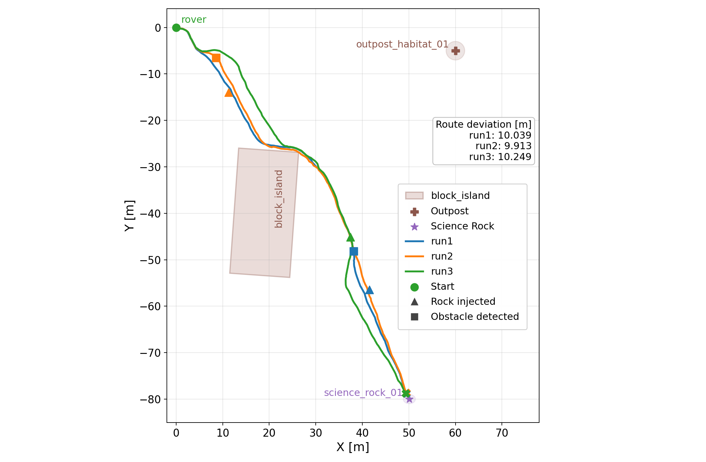

# Results

This set of experiments follows the composite scenario pattern from Example 4 in the prompt quick reference and the reference mission in [REF_SCENARIO.md](/home/keila/robotics/marti/REF_SCENARIO.md): the rover must navigate toward `science_rock_01` using the baseline `base_bt.xml` autonomy while preserving battery- and speed-related monitor constraints. In all three generated scenarios, the primary evaluation target is navigation autonomy under runtime obstacle blocking, and the secondary injected uncertainty is degraded obstacle interpretation on the autonomy-facing perception interface.

All three runs reached the mission goal waypoint, but they differ in how clearly the injected uncertainty was detected, how strongly the avoidance behavior could be attributed to the injected fault, and how quickly the rover recovered after the disturbance. The three scenario drivers below reuse the same reference mission but instantiate the coupled obstacle-plus-sensing disturbance in slightly different ways.

## Scenario Descriptions

### Run 1: `obstacle_sensing_stress`

Run 1 injects a runtime blocking rock on the nominal route to `science_rock_01` and simultaneously applies delayed and noisy obstacle classifications on the obstacle topics consumed by the autonomy stack. The scenario is designed to test whether the rover can still detect the injected obstacle, perform attributed obstacle avoidance, and recover progress without violating `MR_009` or `MR_011`.

### Run 2: `navigation_obstacle_degraded_perception`

Run 2 keeps the same reference goal and monitor assumptions, but emphasizes degraded obstacle interpretation on the autonomy-facing obstacle topics after the runtime rock is spawned. The driver also publishes derived observability signals, such as `/at_science_rock`, to support runtime attribution and goal verification. This scenario focuses on whether the rover can still progress safely when obstacle evidence is delayed or weakened by the injected sensing disturbance.

### Run 3: `navigation_obstacle_degraded_perception` full run

Run 3 is the uninterrupted full-run execution of the degraded-perception scenario driver. It uses the same reference mission and coupled rock-plus-sensing disturbance, but lets the BT-driven mission continue to a natural `goal_reached` termination before the `1200 s` timeout. This run is the clearest end-to-end test of whether the rover can finish the mission under the injected composite stress while the baseline safety monitors remain observable.

## Combined Navigation Logs Plot

## Runtime ROS Measurements And Derived Metrics

The scenario drivers subscribe to or derive runtime ROS signals and convert them into evaluation metrics that describe perception, avoidance, recovery, safety preservation, and mission completion.

| Runtime ROS measurement or signal | Main ROS topics or source | Derived metrics or checks |
| --- | --- | --- |
| Rover pose and progress along the mission route | `/mobile_base_controller/odom` | `route_deviation_m`, `post_injection_route_deviation_m`, mission progress ratio, distance-to-fault context |
| Autonomy-facing obstacle interpretation under degradation | `/obstacle/front`, `/obstacle/left`, `/obstacle/right`, `/obstacle/state` | `obstacle_detection_latency_ms`, `detection_signal_source`, `false_obstacle_rate`, detection attribution |
| Raw LiDAR fallback evidence | `/scan` | `raw_scan_detection_latency_ms` |
| Behavior response and maneuver classification | `/cmd_vel` | `adaptation_speed_ms`, `recovery_rate_ms`, `observed_control_rationale`, `reaction_scope`, `reaction_attribution_status` |
| Battery safety context | `/battery/soc`, `/battery/near_outpost` | `MR_009` preservation, low-battery confound checks |
| Full-battery speed preservation | `/battery/soc` with `/cmd_vel` | `MR_011` preservation |
| Goal completion observability | Derived `/at_science_rock` status plus mission progress | `science_rock_01_reached`, `mission_deadline_met` |
| Injected obstacle lifecycle | Scenario-driver runtime timeline and injected Gazebo entity state | injection verification, encounter status, evaluation window after encounter |

## Per-Run Runtime Metrics

| Metric | Run 1 | Run 2 | Run 3 |
| --- | ---: | ---: | ---: |
| Scenario package | `obstacle_sensing_stress` | `navigation_obstacle_degraded_perception` | `navigation_obstacle_degraded_perception` |
| Termination reason | `goal_reached` | `goal_reached` | `goal_reached` |
| Outcome assessment | `PASS` | `FAIL` | `DEGRADED` |
| Baseline outcome assessment | `PASS` | `PASS` | `DEGRADED` |
| Injected outcome assessment | `PASS` | `FAIL` | `FAIL` |
| Goal reached | `true` | `true` | `true` |
| Mission deadline met | `true` | `true` | `true` |
| Injection encountered | `true` | `true` | `true` |
| Detection signal source | `obstacle/front\|left\|right` | `/obstacle/front` | `/obstacle/left` |
| Obstacle detection latency (ms) | `8000.0` | `8600.0` | `1900.0` |
| Raw scan detection latency (ms) | `n/a` | `n/a` | `n/a` |
| Adaptation speed (ms) | `6364.0` | `n/a` | `n/a` |
| Recovery duration (ms) | `3044.0` | `11900.0` | `n/a` |
| Route deviation (m) | `10.039` | `9.913` | `10.249` |
| Post-injection route deviation (m) | `7.643` | `9.913` | `7.817` |
| False obstacle rate | `43.45%` | `0.0%` | `30.56%` |
| Evaluation window after encounter (s) | `97.796` | `239.296` | `95.2` |
| Observed control rationale | `obstacle_avoidance` | `obstacle_avoidance` | `unknown` |
| Reaction scope | `injected_only` | `indeterminate` | `indeterminate` |
| Reaction attribution status | `true` | `false` | `false` |
| MR_009 preserved | `true` | `true` | `true` |
| MR_011 preserved | `true` | `true` | `false` |
| Collision with injected obstacle | `false` | `false` | `false` |

## Data Organization Summary

| Artifact Type | Location | Purpose |
| --- | --- | --- |
| Scenario prompt answer | `scenario_X/final_answer.md` | Generation rationale, injected uncertainty specs, reference mission |
| ROS bag files (raw messages) | `records/*/rosbags/` or subdirectories | Replay topics: odometry, obstacle state, sensor data, battery, cmd_vel |
| Derived metrics | `records/*/metrics/` or embedded in report | Detection latency, route deviation, recovery behavior, safety checks |
| BT runtime trace | `records/*/runtime/` or `full_run_bt_runtime_*/` | Tick logs, node state transitions, execution timeline |
| Launcher logs | `records/*/launch_*.log` | Node startup, parameter binding, ROS2 initialization |
| Execution report | `records/*/scenario_*_report.md` or `records/*/` | Summary findings, attribution status, PASS/FAIL outcome |
| Authoring workflow logs | `scenario_X/codex_autoring_workflow_logs.jsonl` | Scenario generation conversation trace (Scenario 1 only) |
| Rollout execution log | `scenario_X/rollout-*.jsonl` | Timestamped event stream during driver execution (Scenarios 2 & 3) |

All three scenarios can be replayed using their rosbag files and re-evaluated using the corresponding scenario driver package in their `spacetry_scenario_*` directories.

