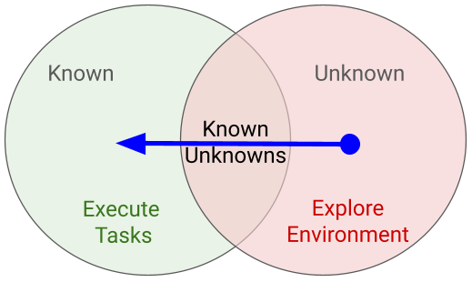

# Space Robotics Missions

This document describes the rover's functionalities that can be used to implement self-adaptive behavior. Additional simulation environment configurations relevant to mission goals specification are also described.

## Goals
The main goal of the deployed rovers is to conduct scientific exploration and sampling of Mars. Depending on the rover payload configuration, different types of samples  or payload data can be collected. 

The goal of the rover mission will be to explore the surrounding environment starting from the dock_pad location. An important aspect in the design to consider are the <u>terrain obstacles</u> and <u>battery energy levels</u>.

The idea is that you design a mission that explores an unknown environment surrounding the rover to find sampling locations when a payload is being triggered by a science instrument. In this case, the camera and the lidar. Figure 1 below depicts the overall idea of the mission, where the exploration goal is to find areas that align with the robot’s sampling and sensing capabilities.

 Fig. 1: Robotics mission goals.

## Rover Capabilities

### Rover Actions

The demo nodes from `curiosity_rover_demo` (`mars_rover.launch.py`) expose ROS 2 services for rover actions:

| Service | Action |
|---|---|
| `/move_forward` | Move rover forward |
| `/move_stop` | Stop rover movement |
| `/turn_left` | Turn rover left |
| `/turn_right` | Turn rover right |
| `/open_arm` | Open rover arm |
| `/close_arm` | Close rover arm |
| `/mast_open` | Open mast |
| `/mast_close` | Close mast |
| `/mast_rotate` | Rotate mast |

### Rover Sensor Topics

| Sensor | ROS 2 Topic | Message Type | Notes |
|---|---|---|---|
| Camera | `/image_raw` | `sensor_msgs/Image` | Bridged via `ros_gz_image` |
| LiDAR | `/scan` | `sensor_msgs/LaserScan` | Bridged via `ros_gz_bridge` |
| Odometry | `/model/curiosity_mars_rover/odometry` | `nav_msgs/Odometry` | Bridged via `ros_gz_bridge` |
| Joint states | `/joint_states` | `sensor_msgs/JointState` | Published by `joint_state_broadcaster` |
| Clock | `/clock` | `rosgraph_msgs/Clock` | Simulation time; all nodes use `use_sim_time: true` |

## SpaceTry packages and their role on the mission

### `spacetry_bt` — Behavior Tree mission runner

The BT runner (`spacetry_bt_runner`) loads a BehaviorTree.CPP XML file and ticks it at a configurable rate (default 10 Hz). It provides 10 custom BT nodes:

| BT Node | Type | Description |
|---|---|---|
| `SetGoal` | SyncAction | Load waypoint coordinates from parameters (e.g., `waypoints.science_rock`) and output as `Goal2D` blackboard entry |
| `NavigateWithAvoidance` | StatefulAction | Navigate to goal with integrated LiDAR obstacle avoidance (reverse, turn, arc phases); publishes `/cmd_vel` commands |
| `GoalReached` | Condition | Returns SUCCESS if rover is within distance tolerance of goal (checks odometry) |
| `ObstacleInDirection` | Condition | Returns SUCCESS if obstacle detected in specified direction (front/left/right) from perception or scan data |
| `SelectAvoidanceDirection` | SyncAction | Analyze obstacle state and select optimal avoidance direction (left/right); outputs `turn_direction` and `reverse_first` |
| `DriveTowardGoal` | StatefulAction | Simple goal-seeking without obstacle avoidance (proportional heading control); publishes `/cmd_vel` |
| `AvoidObstacle` | StatefulAction | Execute avoidance maneuver in selected direction from `SelectAvoidanceDirection` (reverse, turn, arc phases) |
| `AlignToGoal` | StatefulAction | Rotate rover in place to align with goal heading; publishes `/cmd_vel` angular commands |
| `StopAndObserve` | StatefulAction | Stop all motion and wait for specified duration (default 3 seconds) |
| `LogMessage` | SyncAction | Log a string message to ROS logger (for debugging/mission milestones) |
| `KeepRunning` | StatefulAction | Utility node that keeps a parent or external logic in RUNNING state |

### `spacetry_battery` — Battery manager node

A standalone node that simulates rover battery state. It subscribes to `/cmd_vel`, `/joint_states`, and odometry to compute power consumption, and publishes:

| Topic | Type | Purpose |
|---|---|---|
| `/battery_state` | `sensor_msgs/BatteryState` | Full battery state (voltage, current, SOC, charging status) |
| `/battery/soc` | `std_msgs/Float32` | State-of-charge fraction (0.0–1.0) |
| `/battery/near_outpost` | `std_msgs/Bool` | `true` when rover is within `outpost_radius_m` of the outpost |

Key parameters: `capacity_wh` (120 Wh), `drain_base_w` (4 W idle), `drain_move_w_per_mps` (55 W per m/s), `outpost_recharge_w` (90 W near outpost). The BT can read `/battery/soc` to decide when to return for recharging.

### `spacetry_perception` — Obstacle direction classifier

Processes `/scan` (LaserScan) data and classifies obstacles into directional sectors using TF2 transforms into `base_link`:

| Topic | Type | Content |
|---|---|---|
| `obstacle/front` | `std_msgs/Bool` | Obstacle in front sector (±20°) |
| `obstacle/left` | `std_msgs/Bool` | Obstacle in left sector (60°–120°) |
| `obstacle/right` | `std_msgs/Bool` | Obstacle in right sector |
| `obstacle/state` | `std_msgs/String` | Priority label: `FRONT` > `LEFT` > `RIGHT` > `CLEAR` |

These topics are designed for BT condition nodes to make navigation decisions without raw scan processing.

### `spacetry_mission` — Mission configuration

YAML-based mission configuration consisting of three files:

- **`waypoints.yaml`** — Named navigation waypoints in world frame (used by bringup for spawn location and by BT for navigation goals)

- **`objects.yaml`** — World objects with semantic types (validated against the SDF by `validate_mission_config.py`)

- **`mission_01.yaml`** — Ordered objective list with associated task type.

## Mars Outpost World

The Gazebo world (`mars_outpost.sdf`) defines a Martian environment with reduced gravity (3.711 m/s²) and the following scene entities:

| Instance name | Model | Role |
|---|---|---|
| `outpost_habitat_01` | `station` | Outpost base station |
| `science_rock_01` | `rock_5` | Science sampling target |
| `block_island` | `block_island` | Terrain hazard obstacle |
| `curiosity_path` | `curiosity_path` | Ground terrain (defined in `curiosity_gazebo` from Space ROS Demos) |

Physics is tuned for performance: 4 ms step size at 250 Hz update rate (ODE solver, `quick` type), with shadows disabled.

